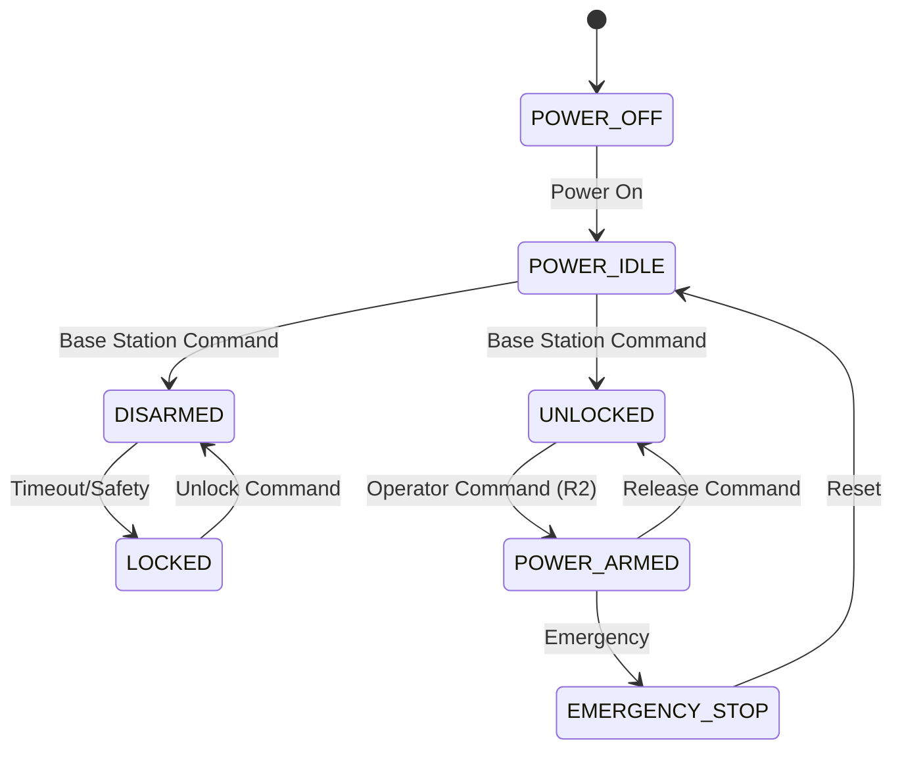

# SIRI-Elec
Electrical systems for SIRI rover - A modular hardware interface framework

## Overview

SIRI-Elec provides a comprehensive hardware interface system for the SIRI rover, built around a high-speed CAN network backbone that connects all rover subsystems. The system uses a modular HAT-based architecture for scalability and maintainability.

## Architecture

### Hardware Interface Framework
The core of SIRI-Elec is a **Common Hardware Interface** that standardizes communication between:
- **Backplane**: Central CAN network hub with compute module
- **HAT Modules**: Distributed control subsystems that plug into the backplane

### Key Components

#### Backplane
- Central compute node (Jetson Orin Nano)
- Dual SH560 CAN transceivers (redundancy)
- Multiple HAT card slots for expansion
- Broadcast and priority-based communication

#### HAT Modules
- **TemplateHAT**: Base template for creating new HAT modules
- **ArmHAT**: Robotic arm control and actuation
- **DriveHat**: Motor control and odometry
- **BPS**: Battery protection and power management
- **SciHat**: Scientific payload control
- **SenseHat**: Environmental and onboard sensing

## Network Architecture

### CAN Network Specifications
- **Speed**: Up to 1 Mbps
- **Topology**: Multi-drop bus supporting 32+ nodes
- **Protocol**: Extended CAN IDs with priority-based arbitration
- **Reliability**: Built-in error checking and collision handling

### Priority System
1. **Jetson** (Priority 1) - Main compute and coordination
2. **DriveHat** (Priority 2) - Low-latency motor control
3. **BPS** (Priority 3) - Critical battery monitoring
4. **ArmHat** (Priority 4) - Robotic arm control
5. **SciHat** (Priority 5) - Scientific operations
6. **SenseHat** (Priority 6) - Environmental sensing

## Project Structure

```
SIRI-Elec/
├── TemplateHAT/          # Base HAT template (submodule)
├── ArmHAT/               # Arm control HAT (submodule)
├── HwInf/                # Hardware interface implementations
├── hw_inf_mappings.md    # Address and component mappings
├── docs.md               # Technical API documentation
└── README.md             # This overview
```

## Getting Started

1. **Clone with submodules**:
   ```bash
   git clone --recursive https://github.com/your-org/SIRI-Elec.git
   ```

2. **Initialize submodules** (if already cloned):
   ```bash
   git submodule update --init --recursive
   ```

3. **Review hardware mappings**: See `hw_inf_mappings.md` for CAN addresses and component assignments

4. **Check technical documentation**: See `docs.md` for detailed API specifications

## Development

### Creating New HATs
1. Use `TemplateHAT/` as starting point
2. Assign addresses from `hw_inf_mappings.md`
3. Implement required interface methods
4. Test on CAN network before integration

### Testing
CAN network testing tools are available in `HwInf/Testing/`

## State Machine Architecture

All HATs implement a standardized state machine for safety and operational control:



### State Definitions
- **POWER_OFF**: System completely powered down
- **POWER_IDLE**: Default state after boot, commands ignored for safety
- **DISARMED**: Software active, hardware locked, sensors operational
- **UNLOCKED**: Ready for activation, motors unlocked, awaiting arm command
- **POWER_ARMED**: Fully operational mission state, all commands accepted
- **LOCKED**: Safety lock engaged, all commands blocked
- **EMERGENCY_STOP**: Emergency halt, requires manual reset

## Features

- **Modular Design**: Easy to add/remove HAT modules
- **Fault Tolerant**: Redundant CAN transceivers and error handling
- **Scalable**: Support for additional HATs without network redesign
- **Real-time**: Priority-based message arbitration for time-critical operations
- **Standardized**: Common interface across all HAT modules
- **Safety-First**: Multi-layer state machine with fail-safe mechanisms
- **Mission-Ready**: Designed for rover operations with operator controls

## Documentation

- **Overview**: This README
- **Technical APIs**: `docs.md`
- **Hardware Mappings**: `hw_inf_mappings.md`
- **State Machine**: `state_machine.md`
- **Individual HATs**: See respective submodule documentation
