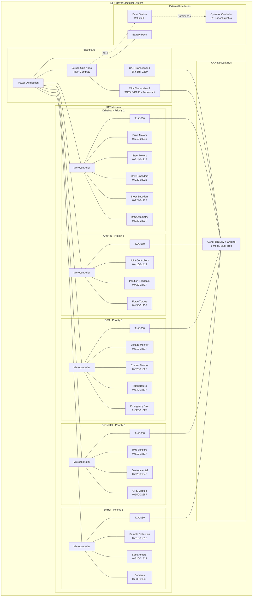
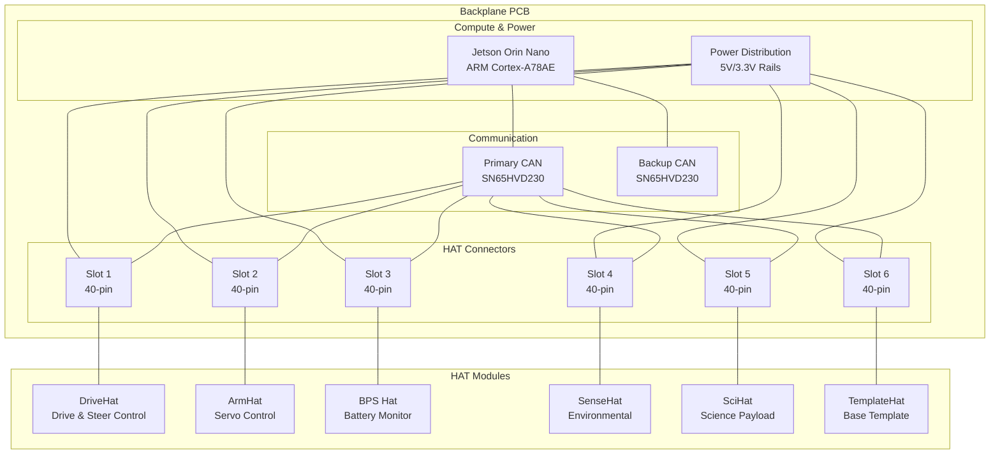
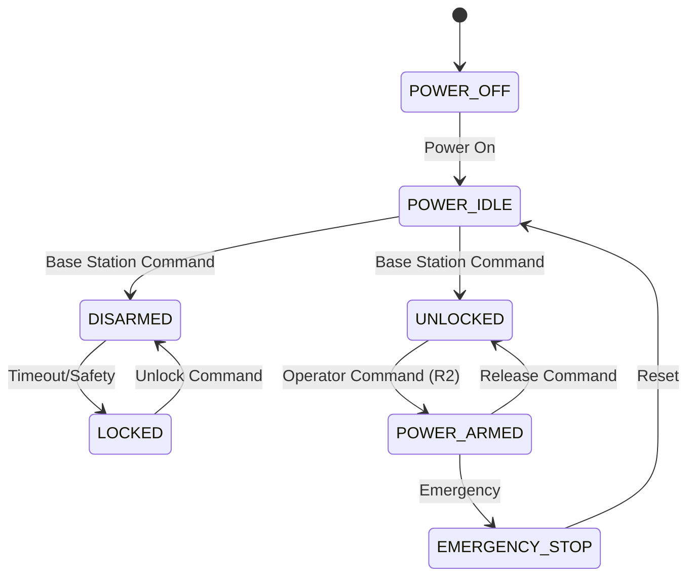

# SIRI-Elec
Electrical systems for SIRI rover - A modular hardware interface framework

## Overview

SIRI-Elec provides a comprehensive hardware interface system for the SIRI rover, built around a high-speed CAN network backbone that connects all rover subsystems. The system uses a modular HAT-based architecture for scalability and maintainability.

hahahahha
## Architecture

### System Overview Diagram



### Hardware Interface Framework
The core of SIRI-Elec is a **Common Hardware Interface** that standardizes communication between:
- **Backplane**: Central CAN network hub with compute module
- **HAT Modules**: Distributed control subsystems that plug into the backplane

### Physical Architecture



### Key Components

#### Backplane
- **Central compute node**: Jetson Orin Nano with ARM Cortex-A78AE
- **Dual CAN transceivers**: SN65HVD230 (3.3V compatible) with redundancy for fault tolerance
- **Multiple HAT slots**: 6x VGA connectors for expansion
- **Power distribution**: Regulated 5V supply to all HATs
- **Broadcast communication**: Priority-based CAN arbitration

#### HAT Modules
- **TemplateHAT**: Base template for creating new HAT modules
- **ArmHAT**: Robotic arm control and actuation (Teensy + TJA1050)
- **DriveHat**: 4-wheel independent drive and steer control with encoders (Teensy + TJA1050)
- **BPS**: Battery protection and power management (Teensy + TJA1050)
- **SciHat**: Scientific payload control (Teensy + TJA1050)
- **SenseHat**: Environmental and onboard sensing (Teensy + TJA1050)

### Modular Design Benefits
- **Hot-swappable**: HATs can be replaced without system shutdown
- **Scalable**: Add new functionality by creating new HAT modules
- **Fault isolation**: Individual HAT failures don't affect other systems
- **Standardized interface**: All HATs use same 40-pin connector and CAN protocol
- **Development friendly**: Test individual HATs independently

## Network Architecture

### CAN Network Specifications
- **Speed**: Up to 1 Mbps
- **Topology**: Multi-drop bus supporting 32+ nodes
- **Protocol**: Extended CAN IDs with priority-based arbitration
- **Reliability**: Built-in error checking and collision handling

### Priority System
1. **Jetson** (Priority 1) - Main compute and coordination
2. **DriveHat** (Priority 2) - Low-latency drive and steer motor control
3. **BPS** (Priority 3) - Critical battery monitoring
4. **ArmHat** (Priority 4) - Robotic arm control
5. **SciHat** (Priority 5) - Scientific operations
6. **SenseHat** (Priority 6) - Environmental sensing

## Project Structure

```
SIRI-Elec/
├── TemplateHAT/          # Base HAT template (submodule)
├── ArmHAT/               # Arm control HAT (submodule)
├── HwInf/                # Hardware interface implementations
│   └── Testing/          # CAN network testing tools
├── README.md             # This overview and getting started
├── architecture.md       # Detailed system architecture and diagrams
├── docs.md               # Technical API documentation
├── hw_inf_mappings.md    # CAN addresses and component mappings
└── state_machine.md      # State machine specifications and use cases
```

## Getting Started

**🚀 New to SIRI-Elec? Start here: [GETTING_STARTED.md](GETTING_STARTED.md)**

Our comprehensive getting started guide covers:
- **Development environment setup** (Arduino IDE, VS Code, Teensyduino)
- **AI development tools** - Cursor, Kiro, Claude models, ChatGPT, and more
- **Cost-effective AI usage** strategies for different development phases
- **Step-by-step tutorials** for building your first HAT
- **Troubleshooting** common issues
- **Best practices** for HAT development

### Quick Setup
1. **Clone with submodules**:
   ```bash
   git clone --recursive https://github.com/your-org/SIRI-Elec.git
   ```

2. **Follow the setup guide**: [GETTING_STARTED.md](GETTING_STARTED.md)

3. **Review documentation**:
   - [hw_inf_mappings.md](hw_inf_mappings.md) - CAN addresses and component assignments
   - [docs.md](docs.md) - Technical API specifications  
   - [architecture.md](architecture.md) - System design details

## Development

### Creating New HATs
1. **Start with template**: Use [TemplateHAT/](TemplateHAT/) as your foundation
2. **Setup environment**: Follow [GETTING_STARTED.md](GETTING_STARTED.md) for IDE and AI tool setup
3. **Choose AI tools**: See [AI Development Tools](GETTING_STARTED.md#-ai-development-tools) section for recommendations
4. **Assign addresses**: Reserve addresses from [hw_inf_mappings.md](hw_inf_mappings.md)
5. **Implement interfaces**: Follow specifications in [docs.md](docs.md)
6. **Follow state machine**: Implement requirements from [state_machine.md](state_machine.md)
7. **Test thoroughly**: Validate on CAN network before integration

### AI Development Tools
Our [getting started guide](GETTING_STARTED.md#-ai-development-tools) provides detailed recommendations:
- **AI IDEs**: Cursor (prototyping), Kiro (waitlist), Windsurf, VS Code + Copilot
- **AI Models**: Claude 4 (large codebases), Claude 3.5 (specific problems), ChatGPT (learning)
- **Cost strategies**: How to use expensive models effectively
- **Use case guidance**: Which tool for which development phase

### Testing
CAN network testing tools are available in `HwInf/Testing/` - see [architecture.md](architecture.md) for testing workflow

## State Machine Architecture

All HATs implement a standardized state machine for safety and operational control:



### State Definitions
- **POWER_OFF**: System completely powered down
- **POWER_IDLE**: Default state after boot, commands ignored for safety
- **DISARMED**: Software active, hardware locked, sensors operational
- **UNLOCKED**: Ready for activation, motors unlocked, awaiting arm command
- **POWER_ARMED**: Fully operational mission state, all commands accepted
- **LOCKED**: Safety lock engaged, all commands blocked
- **EMERGENCY_STOP**: Emergency halt, requires manual reset

## Features

- **Modular Design**: Easy to add/remove HAT modules
- **Fault Tolerant**: Redundant CAN transceivers and error handling
- **Scalable**: Support for additional HATs without network redesign
- **Real-time**: Priority-based message arbitration for time-critical operations
- **Standardized**: Common interface across all HAT modules
- **Safety-First**: Multi-layer state machine with fail-safe mechanisms
- **Mission-Ready**: Designed for rover operations with operator controls

## Documentation

- **[Getting Started Guide](GETTING_STARTED.md)** - Complete setup guide for new developers with AI tools
- **Overview**: This README - System overview and project structure
- **[Architecture](architecture.md)** - Detailed system diagrams, PCB layouts, and design specifications
- **[Technical APIs](docs.md)** - CAN network protocols, HAT interfaces, and implementation guidelines
- **[Hardware Mappings](hw_inf_mappings.md)** - CAN addresses, component assignments, and message structure
- **[State Machine](state_machine.md)** - Safety states, transitions, and mission use cases
- **Individual HATs**: 
  - [TemplateHAT](TemplateHAT/) - Base template for new HAT development
  - [ArmHAT](ArmHAT/) - Robotic arm control implementation

## Contributing

We welcome contributions to SIRI-Elec! Here's how to get started:

### Quick Start
1. **Fork the repository** and clone with submodules
2. **Create a feature branch**: `git checkout -b feature/your-feature-name`
3. **Follow the coding standards** outlined in [docs.md](docs.md)
4. **Test your changes** using the tools in `HwInf/Testing/`
5. **Submit a pull request** with a clear description

### Development Guidelines
- **HAT Development**: Use [TemplateHAT](TemplateHAT/) as your starting point
- **Address Assignment**: Reserve addresses in [hw_inf_mappings.md](hw_inf_mappings.md)
- **State Machine**: Implement the standardized states from [state_machine.md](state_machine.md)
- **Documentation**: Update relevant docs when adding features
- **Testing**: Ensure CAN network compatibility before submission

### Areas for Contribution
- New HAT module implementations
- CAN network testing tools
- State machine enhancements
- Documentation improvements
- Hardware validation and testing

For detailed technical specifications, see our [technical documentation](docs.md).
