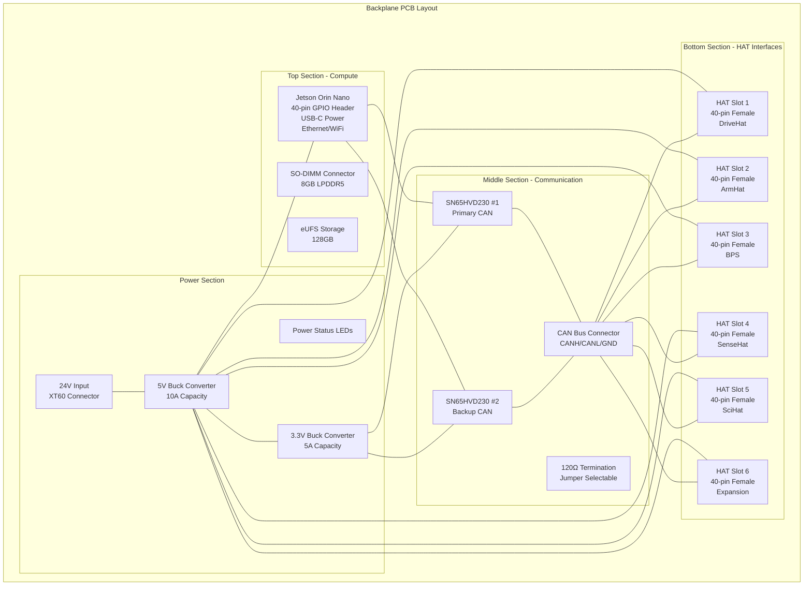
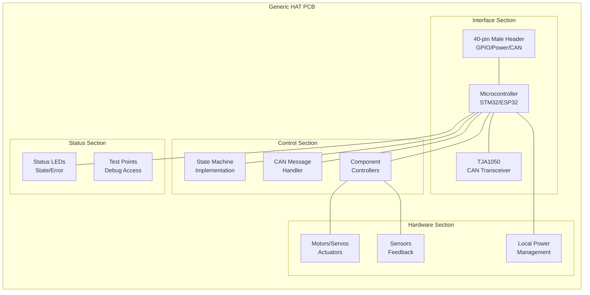
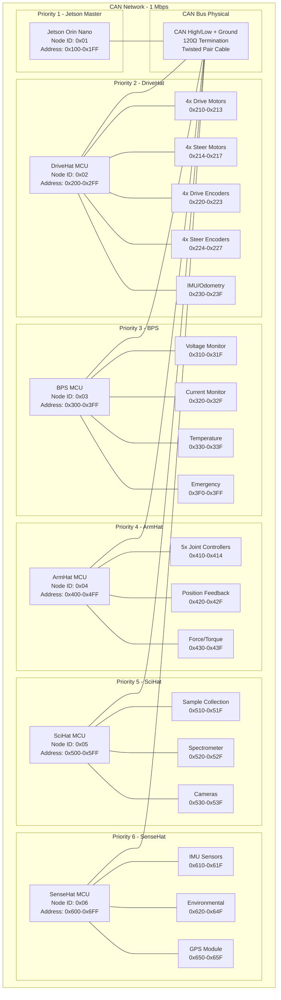
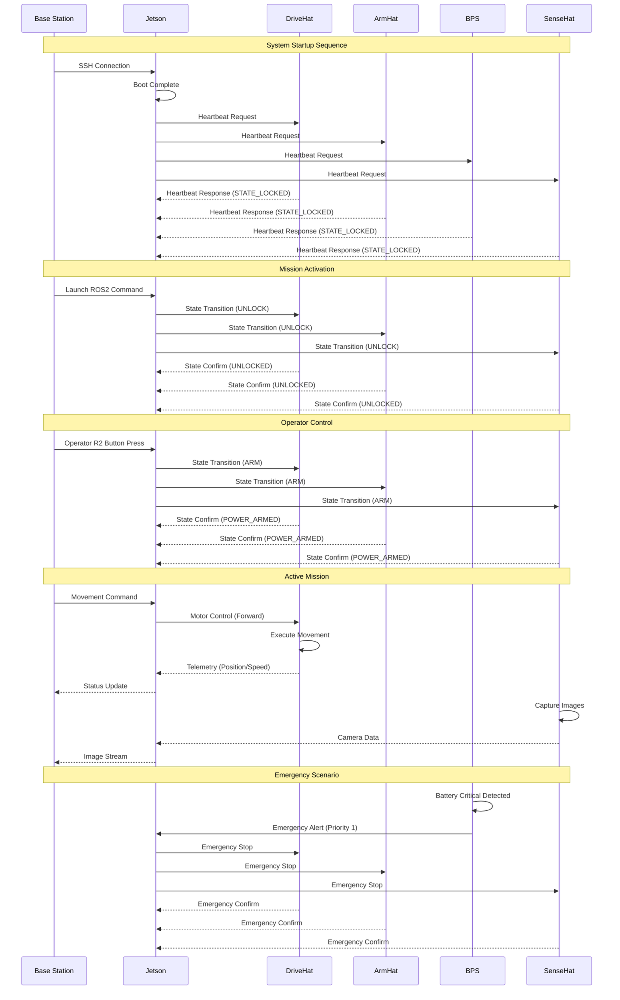
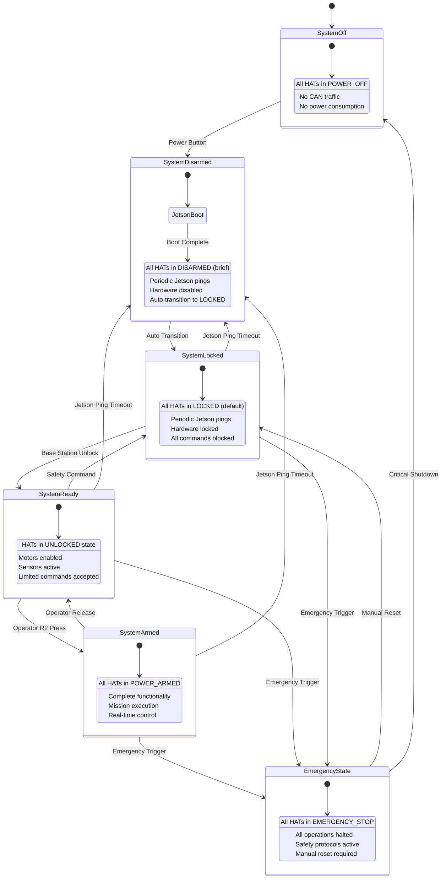
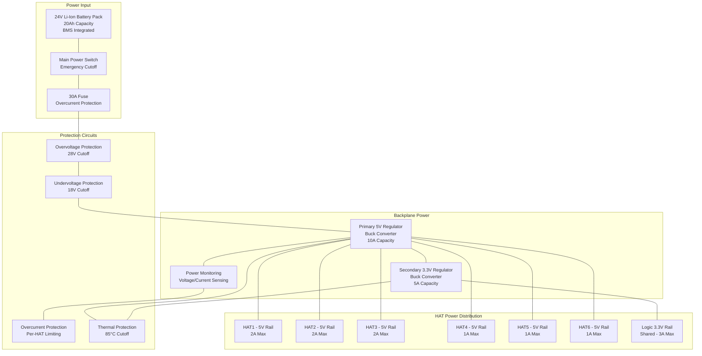
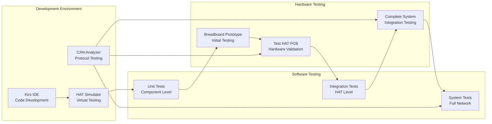
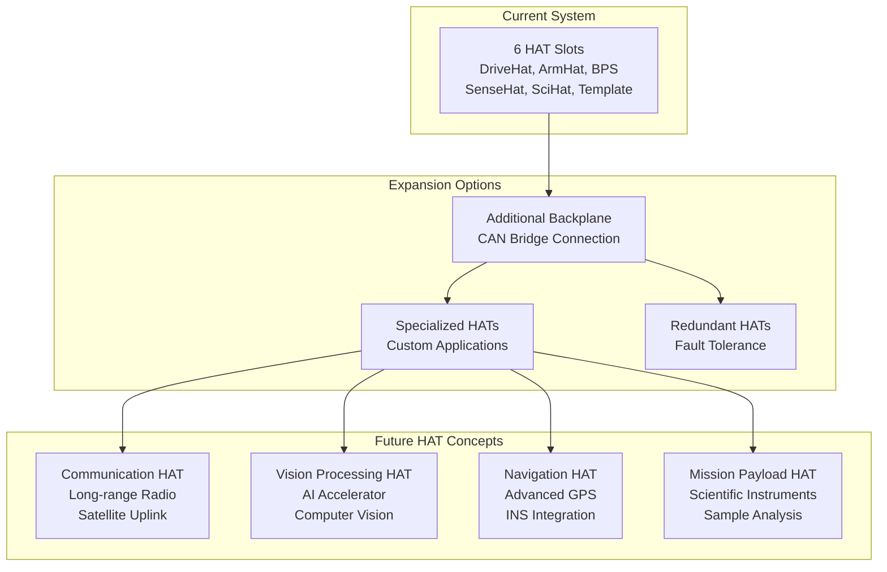

# SIRI-Elec Architecture Documentation

## System Architecture Overview

The SIRI-Elec system implements a modular, distributed architecture centered around a CAN network backplane. This design provides scalability, fault tolerance, and ease of development while maintaining real-time performance for rover operations.

## Physical Layer Architecture

### Backplane Design

**CAN Transceiver Selection:**
- **Jetson Backplane**: SN65HVD230 (3.3V compatible with Jetson GPIO)
- **HAT Modules (Teensy)**: TJA1050 (5V tolerant, robust for distributed modules)

### HAT Module Structure

## Network Architecture

### CAN Network Topology

## Message Flow Architecture

### Command and Control Flow

## State Machine Integration

### System-Wide State Coordination

## Power Architecture

### Power Distribution System

## Development and Testing Architecture

### Development Workflow

## Scalability and Expansion

### Future Expansion Capabilities

This architecture provides a solid foundation for the SIRI rover's electrical systems while maintaining flexibility for future enhancements and mission-specific modifications.