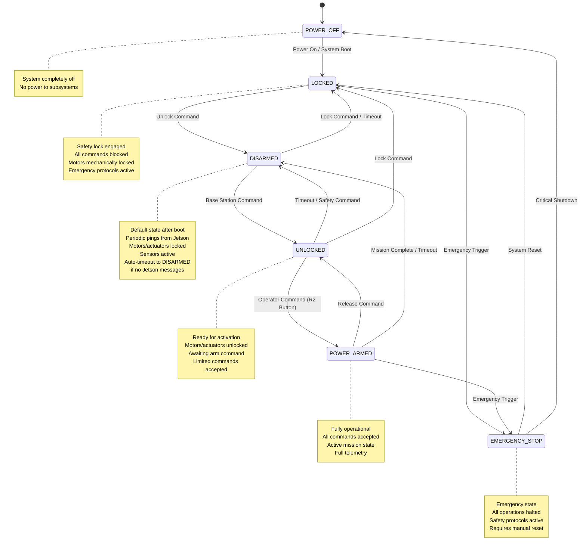

# HAT State Machine Documentation

## State Machine Overview

All HATs in the SIRI-Elec system implement a standardized state machine for power management, safety, and operational control. This ensures consistent behavior across all subsystems and provides multiple layers of safety for mission-critical operations.

## State Machine Diagram



## State Definitions

### POWER_OFF
- **Description**: System completely powered down
- **Characteristics**:
  - No power to HAT subsystems
  - CAN interface inactive
  - No heartbeat transmission
- **Entry Conditions**: System shutdown, power loss
- **Exit Conditions**: Power button pressed, external power applied

### LOCKED
- **Description**: Default secure state after system boot
- **Characteristics**:
  - All electrical systems powered
  - CAN interface active
  - All commands blocked except unlock
  - Motors/actuators mechanically/electrically locked
  - Sensors operational for monitoring
  - Emergency protocols active
  - Requires explicit unlock command
- **Entry Conditions**: System boot, timeout from any state, safety commands, lock commands
- **Exit Conditions**: Authorized unlock command

### DISARMED
- **Description**: Intermediate state between locked and unlocked
- **Characteristics**:
  - All electrical systems powered
  - CAN interface active
  - Periodic pings expected from Jetson
  - Motors/actuators electrically disabled
  - Sensors fully operational
  - Configuration commands accepted
  - Movement commands ignored
  - Auto-timeout to LOCKED if no Jetson messages received
- **Entry Conditions**: Unlock command from locked state, timeout from other states, mission completion
- **Exit Conditions**: Base station unlock command to unlocked, timeout to locked

### UNLOCKED
- **Description**: Ready for activation, awaiting operator command
- **Characteristics**:
  - Motors/actuators unlocked and ready
  - Limited command set accepted
  - Calibration procedures available
  - Awaiting arm command from operator
- **Entry Conditions**: Base station unlock command
- **Exit Conditions**: Operator arm command (R2), safety command, reset

### POWER_ARMED
- **Description**: Fully operational mission state
- **Characteristics**:
  - All systems fully operational
  - Complete command set accepted
  - Active mission execution
  - Full telemetry and feedback
  - Real-time control active
- **Entry Conditions**: Operator arm command (R2 button press)
- **Exit Conditions**: Mission complete, emergency stop, operator disarm


### EMERGENCY_STOP
- **Description**: Emergency halt state
- **Characteristics**:
  - All operations immediately halted
  - Safety protocols activated
  - Emergency telemetry transmission
  - Requires manual intervention
- **Entry Conditions**: Emergency button, critical fault, BPS alert
- **Exit Conditions**: Manual reset, critical shutdown

## State Transitions

### Command-Based Transitions
| From State | Command | To State | Authority |
|------------|---------|----------|-----------|
| LOCKED | UNLOCK | DISARMED | Base Station |
| DISARMED | UNLOCK | UNLOCKED | Base Station |
| DISARMED | LOCK | LOCKED | Base Station/Timeout |
| UNLOCKED | ARM | POWER_ARMED | Operator (R2) |
| UNLOCKED | DISARM | DISARMED | Base Station |
| UNLOCKED | LOCK | LOCKED | Base Station |
| POWER_ARMED | DISARM | UNLOCKED | Operator |
| Any State | EMERGENCY | EMERGENCY_STOP | Any Source |

### Automatic Transitions
- **Jetson Ping Timeout**: Any State → LOCKED (when periodic pings from Jetson stop)
- **Safety Timeout**: DISARMED → LOCKED (after 5 minutes of inactivity)
- **Mission Complete**: POWER_ARMED → DISARMED (task completion)
- **Communication Loss**: Any Active State → LOCKED (after timeout period)
- **Power Loss**: Any State → POWER_OFF (immediate)

## Mission Use Case: Lander Egress

### Scenario: Descend down egress ramp on the Lander

#### Pre-Mission Setup
1. **POWER_OFF → LOCKED**
   - Operator presses power button on rover
   - All hardware electrical systems receive power
   - Jetson boots and initializes
   - All HATs enter LOCKED state (default secure state)
   - Radio communications established
   - Jetson begins periodic ping transmission to HATs

2. **Base Station Connection**
   - Operator SSH into rover from base station
   - Launch ROS2 on rover via SSH
   - Launch ROS2 on base station
   - Confirm communication link
   - HATs remain in LOCKED, receiving Jetson pings

#### Mission Activation Sequence
3. **LOCKED → DISARMED**
   - Base station operator sends first unlock command
   - HATs transition from secure locked state to disarmed
   - Basic systems become accessible
   - Jetson continues periodic pings

4. **DISARMED → UNLOCKED**
   - Base station operator sends second unlock command
   - DriveHat: Motors unlocked, ready for commands
   - SenseHat: Cameras and sensors active
   - ArmHat: Remains in safe position
   - SciHat: Payload systems ready but inactive
   - Jetson continues periodic pings

5. **UNLOCKED → POWER_ARMED**
   - Operator turns on joystick
   - Operator presses R2 button (ARM command)
   - DriveHat: Fully operational, accepting movement commands
   - SenseHat: Full telemetry streaming to base station
   - All systems ready for mission execution

#### Mission Execution
5. **Active Operation (POWER_ARMED)**
   - Operator uses joystick to move rover forward
   - Real-time camera feed to base station
   - SLAM/IMU data for position tracking
   - Continuous telemetry for "all wheels contact ground" confirmation
   - RVIZ visualization of rover pose
   - Jetson maintains periodic pings to all HATs

#### Safety Considerations
- **Emergency Stop**: Any critical condition triggers EMERGENCY_STOP
- **Communication Loss**: Timeout from missing Jetson pings triggers automatic return to LOCKED state
- **Battery Critical**: BPS triggers emergency protocols
- **Operator Override**: R2 release returns to UNLOCKED state
- **Automatic Timeout**: All states (except POWER_OFF) timeout to LOCKED if Jetson pings stop

## Implementation Requirements

### State Machine Messages
```cpp
// State machine control messages
#define MSG_TYPE_STATE_UNLOCK       0x30
#define MSG_TYPE_STATE_DISARM       0x31
#define MSG_TYPE_STATE_ARM          0x32
#define MSG_TYPE_STATE_LOCK         0x33
#define MSG_TYPE_STATE_EMERGENCY    0x34
#define MSG_TYPE_STATE_RESET        0x35
#define MSG_TYPE_STATE_QUERY        0x36
#define MSG_TYPE_STATE_RESPONSE     0x37
```

### State Enumeration
```cpp
typedef enum {
    STATE_POWER_OFF = 0,
    STATE_POWER_IDLE = 1,
    STATE_DISARMED = 2,
    STATE_UNLOCKED = 3,
    STATE_POWER_ARMED = 4,
    STATE_LOCKED = 5,
    STATE_EMERGENCY_STOP = 6
} HAT_State_t;
```

### State Machine Interface
```cpp
class HATStateMachine {
public:
    HAT_State_t getCurrentState();
    bool transitionToState(HAT_State_t newState, uint8_t authority);
    bool isCommandAllowed(uint8_t commandType);
    void handleTimeout();
    void handleEmergency();
    uint32_t getStateUptime();
};
```

## Safety Features

### Timeout Protection
- **DISARMED Timeout**: 5 minutes → LOCKED
- **UNLOCKED Timeout**: 2 minutes → DISARMED
- **Communication Timeout**: 10 seconds → LOCKED
- **Heartbeat Timeout**: 5 seconds → EMERGENCY_STOP

### Authority Levels
- **Base Station**: Can unlock, disarm, lock, reset
- **Operator**: Can arm, disarm (from armed state)
- **System**: Can trigger emergency stop, timeouts
- **BPS**: Can trigger emergency shutdown

### Fail-Safe Mechanisms
- Power loss → Immediate safe state
- Communication loss → Automatic lock
- Critical faults → Emergency stop
- Unknown commands → Ignored in safe states